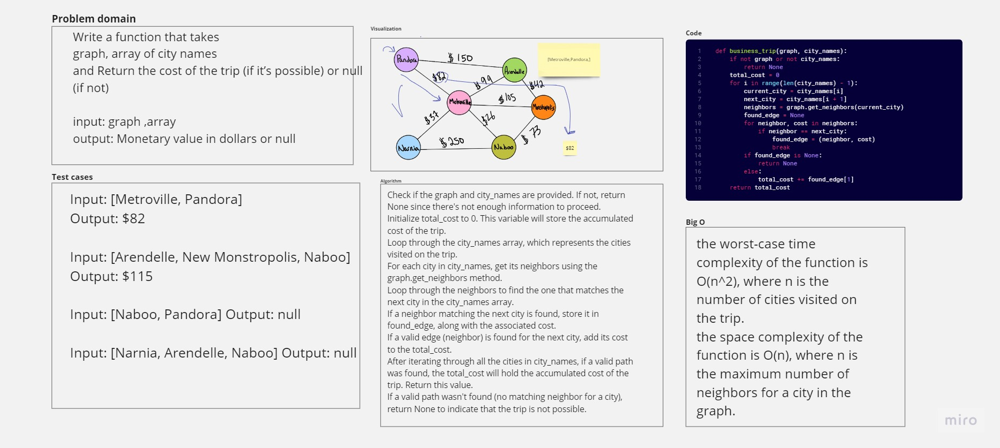

# Code Challenge: Class 37
# Graph_business_trip

## Whiteboard Process


## Approach & Efficiency

**business_trip :** 
the worst-case time complexity of the function is O(n^2), where n is the number of cities visited on the trip.

the space complexity of the function is O(n), where n is the maximum number of neighbors for a city in the graph.

   
python Python/code_challenge37/graph_business_trip/graph_business_trip.py

```python
if __name__ == "__main__":
    graph = Graph()
    
    graph.add_vertex("Metroville")
    graph.add_vertex("Pandora")
    graph.add_edge("Metroville", "Pandora", 82)

    graph.add_vertex("Pandora")
    graph.add_vertex("Arendelle")
    graph.add_edge("Pandora", "Arendelle",150)
    
    graph.add_vertex("Arendelle")
    graph.add_vertex("New Monstropolis")
    graph.add_vertex("Naboo")
    graph.add_vertex("Narnia")
    graph.add_edge("Arendelle", "New Monstropolis", 42)
    graph.add_edge("New Monstropolis", "Naboo", 73)
    graph.add_edge( "Naboo", "Narnia",250)
    
    graph.add_vertex("Naboo")
    graph.add_vertex("Metroville")
    graph.add_edge("Naboo", "Metroville", 26)
    
    graph.add_vertex("New Monstropolis")
    graph.add_vertex("Metroville")
    graph.add_vertex("Narnia")
    graph.add_edge("New Monstropolis", "Metroville", 105)
    graph.add_edge("Arendelle", "Metroville", 99)
    graph.add_edge("Metroville", "Narnia",37)
    
    city_names = ["Metroville", "Pandora", ]
    # city_names = ['Arendelle', 'New Monstropolis', 'Naboo']
    # city_names = ['Naboo', 'Pandora']
    # city_names = ['Narnia', 'Arendelle', 'Naboo']
    cost = business_trip(graph, city_names)
    print("Total cost:", cost) 
```